# HangmanGame-Project with HTML, CSS and Javascript. No frameworks used.

## This is a small project written in HTML, CSS and Javascript to implement the basic funcitonalities of a classic hangman game.

This project is a course exercise that implements the classic hangman game. Here are the following functionalities:

* User will start the game by clicking on the 'START GAME' button
* User will be able to select from three difficulty options (Easy, Medium, Hard)
* User will start guessing the correct word
* Game is over on either of two conditions: Word is guessed correctly before hangman is complete or user loses once hangman is complete before word is guessed.

## Screenshots

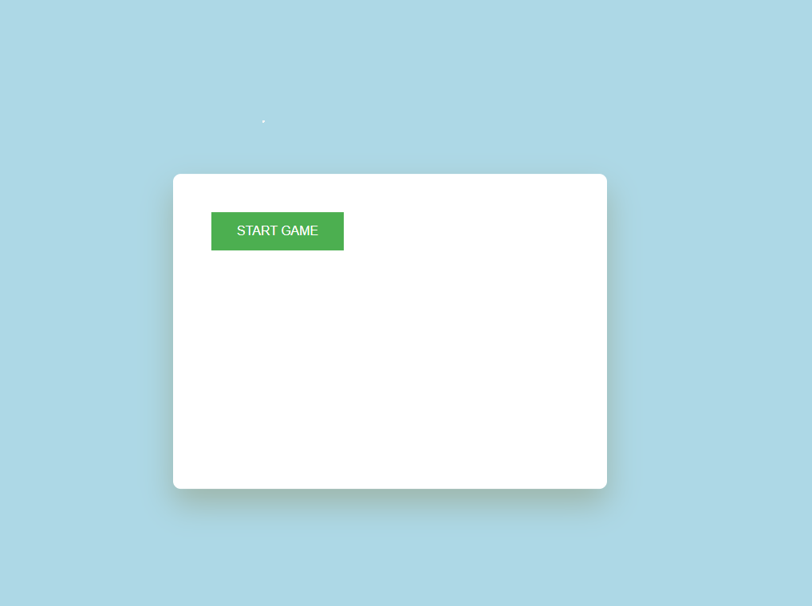

[Video of player choosing difficulty](./images/choose-difficulty-page.mp4)

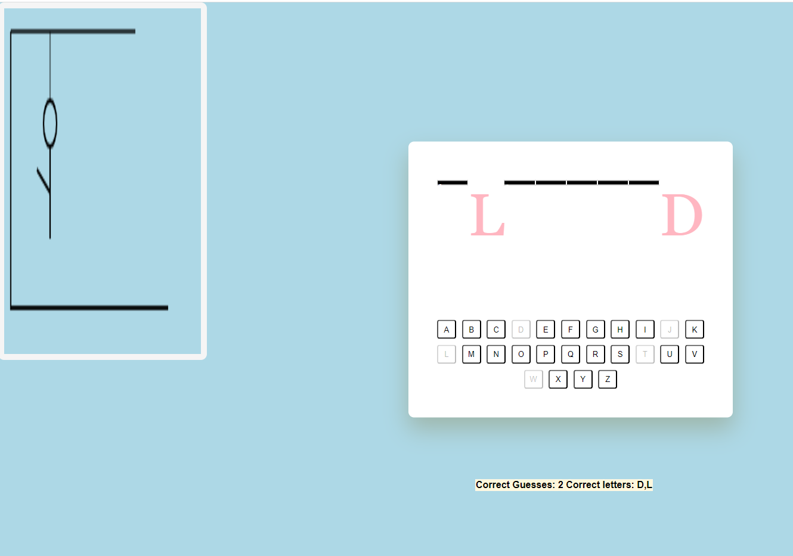


## Some basic git commands:
```
git status
git add
git commit
git push

```

## Game functionality
### HTML file
The html file contains the basic layout of the game page. Here is what this page does:
- links style sheet and javascript in the *head element*
- creates the basic layout of the page using a *header 1 element* and multiple *div elements* that contain the page's main displays
### body element of the html index file
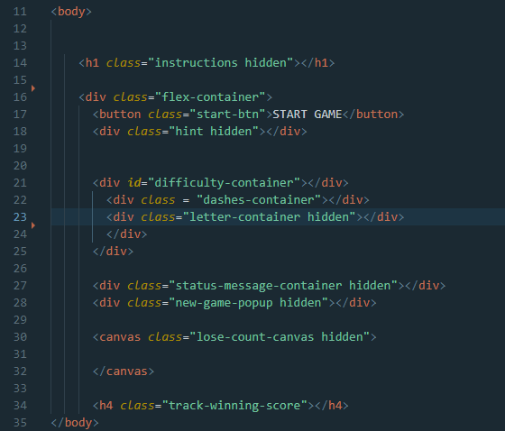

### CSS file
- creates a style sheet that includes all styling for the page.
> External style sheets: None

### Javascript file
- creates a main javascript file which contains all game mechanics


## Javascript file queryselectors and global variables


## Implementation
> * Classes included: None
> * Methods included: 10
> * Independant event listeners: 1

### Main methods:
1. **chooseDifficulty()**
    > * Parameters: None
    > * Event listeners: 1
    * Creates three difficulty buttons that the user can choose from. An array of varied difficult words is created based on the difficulty chosen


2. **generateBlocks()**
    > * Parameters: None
    > * Event listeners: None
    * Generates a block of the 24-alphabet letters as buttons

3. **generateRandomWord()**
    > * Parameters: *array of strings*
    > * Event listeners: None
    * Generates a random word from the passed array of words (*the array passed depends on the chosen diffuclty*)
    * Generates blocks on the page depending on the numbers of letters in the chosen random word from the passed array


4. **guess()**
    > * Parameters: *string*
    > * Event listeners: 1
    * Will accept a random word chosen from the array of strings passed to **generateRandomWord()** method and will process the following:
        - Local variables
            - `correctWord` --> **Data type: array** stores the passed word in an array of letters
            - `letterCount` --> **Date type: array** keeps track of the correct letters and pushes them to the array
            - `found` --> **Date type: boolean** default value is false. Is true if a guessed letter by the user matches a correct letter from the chosen word. Otherwise, remains false

        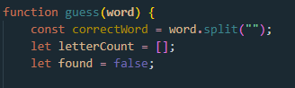

        - Add an event listener to the letterContainer querySelector, which holds the container for the 24-alphabet letter buttons
        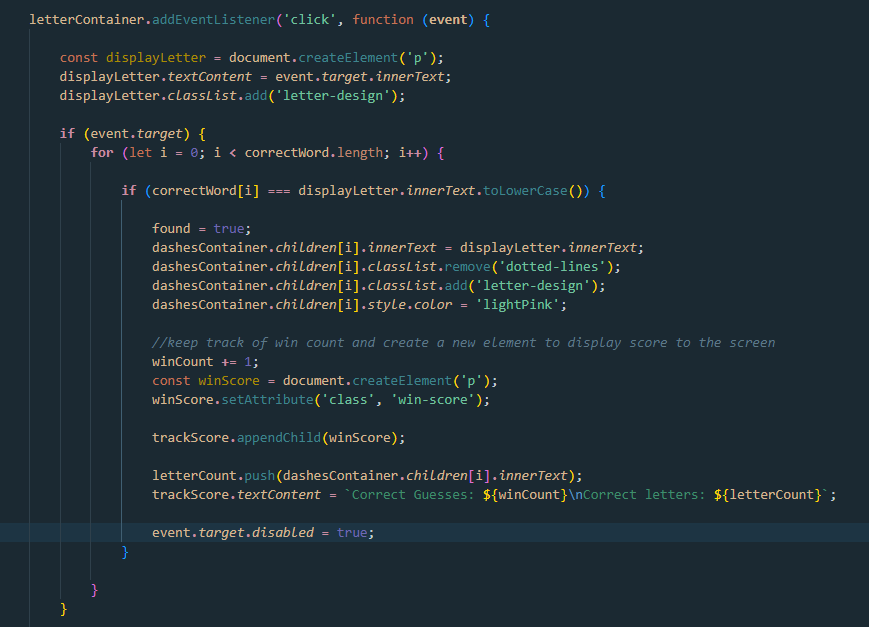

        - After all validations are processed, the method will check if the user has won by calling the **checkIfWon()** method

        - If user still hadn't won, the method will check if the user guessed incorrectly. If `found` local variable is *false* at this point, decrement user health by decrementing the global variable `userHealth` by 1. Every time a user's health is decremented by 1, **drawCanvas()** method is called

        - Method will then check if user has accumulated three wrong guesses during their playthough and will store that in the `wrongGuesses` global variable. If wrongGuesses reaches a maximum of three guesses, **requestHint()** method is called.

5. **requestHint()**
    > * Parameters: *string* , *document.querySelector(class)*
    > * Event listeners: 1
    * This method is called in the **guess()** method and only if it passess the requirement of a maximum of three incorrect guesses (tracked and stored in the `wrongGuesses` global variable)
        - Local variables
            - `hintBtn` --> **Data type: document querySelector** creates an html button element that will allow the user to request a hint by clicking it
            - `randomLetter` --> **Data type: string** keeps track of the random letter we will be extracting from the passed correct word
            - `notIncluded` --> **Data type: array of strings** keeps track of the letters that have already been guessed from the correct word and excludes them from being chosen once the hint is requested

        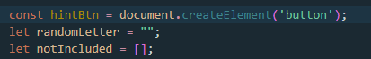

    * Attaches an event listener (*type: click*) to the created button element. Once clicked, the method will check the passed correct word with the passed document querySelector that already contains the guessed correct letters and compare both variables in a *for loop*. Logic goes as follows:
        1. Once button is clicked, check all correct letter included in the passed `document.querySelector`. If validation is passed, push not included letters to the locally created array `notIncluded`
            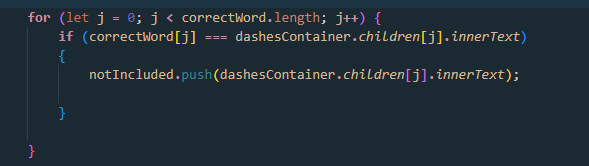

        2. Loop through the newly populated `notIncluded` array and store a random letter of the array in the locally created variable `randomLetter`

            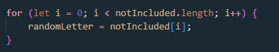

        3. Compare newly populated local variable `randomLetter` with the `document.querySelector` and check to see if a letter that is not included matches any empty spots in the document container

            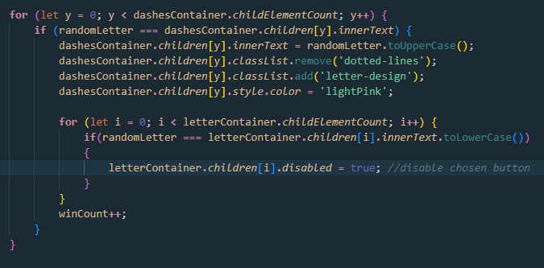

        4. Check if user has guessed the correct word by calling the **checkIfWon()** method

6. **checkIfWon()**
    > * Parameters: string
    > * Event listeners: None
    * Checks if user guessed the correct by checking if global variable `winCount` is greater than length of the correct word. If validation passes, display a message game is won
    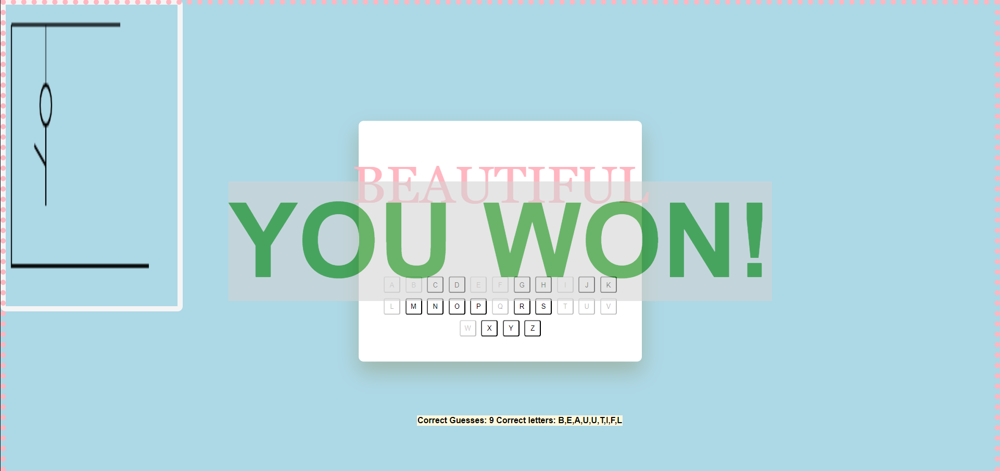

7. **checkIfLose()**
    > Parameters: number
    * checks if user has lost by validating if global variable `userHealth` is 0. If validation passess, display a message game is lost
    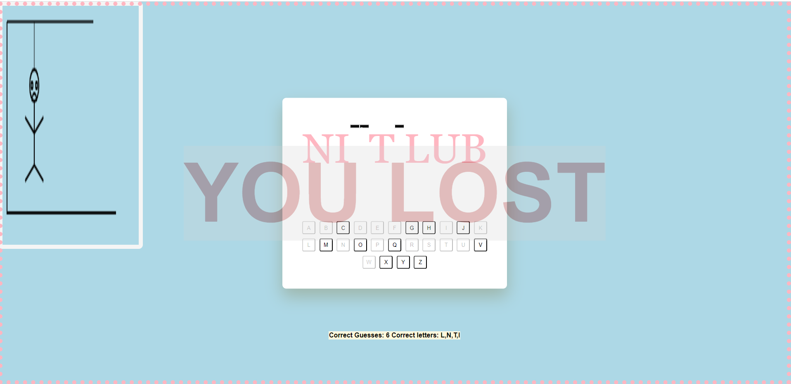

8. **initialCanvas()**
    > * Parameters: None
    > * Event listeners: None
    * draws initial lines that represent where the man will be hanged

10. **drawLine()**
    > Parameters: number, number, number, number
    * A literal method that will be called in **drawCanvas()** and **initialCanvas()** to draw hangman and noose

10. **drawCanvas()**
    > * Parameters: number
    > * Event listeners: None
    * Uses the switch statement to compare decremented cases of global variable `userHealth`. Draws a part of the hangman for each decremented health

11. **hideMessage()**
    > * Parameters: None
    > * Event listeners: None
    * Hide game over message after 5 seconds. ***(called within a setTimeOut() method)***
    * Calls the **resetGame() method**

12. **resetGame()**
    > * Parameters: None
    > * Event listeners: None
    * Resets webpage

# Installation
- fork repository.
- git clone *github-url*

## Credits
Thank you for all my instructors and fellow peers in the Per Scholas Cycle 10 for making this project logical and fun to make!

# You can play the game [here!](https://tamara-703.github.io/HangmanGame-Project/)
